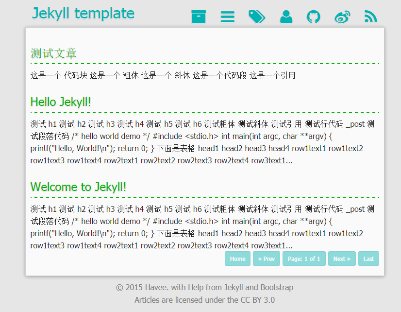

#### Create new post

    rake post title='A Title'
    or
    rake post title="A Title" [date="2012-02-09"] [tags=[tag1,tag2]] [category="category"]

#### Create new page

    rake page name='about.html'

#### Define your color

Edit the file:  `assets/_sass/_custom.scss`

#### Use qiniu cdn
    
    rake qshell

Then, follow tips to do.

> More Info read from [qshell](https://github.com/qiniu/qshell)

#### License

- The Font Awesome font is licensed under the [SIL OFL 1.1](http://scripts.sil.org/OFL)
- Font Awesome CSS, LESS, and SASS files are licensed under the [MIT License](http://opensource.org/licenses/mit-license.html)
- Bootstrap is licensed under the [MIT License](http://opensource.org/licenses/mit-license.html)
- Jekyll is licensed under the [MIT License](http://opensource.org/licenses/mit-license.html)
- Pygments is licensed under the [BSD License](http://opensource.org/licenses/BSD-2-Clause)

> 记录个人的成长点滴，感谢您的关注。

感谢[Havee](http://havee.me/about.html)提供的Jekyll主题。

更多的介绍，详见[Havee 博客](http://havee.me)。